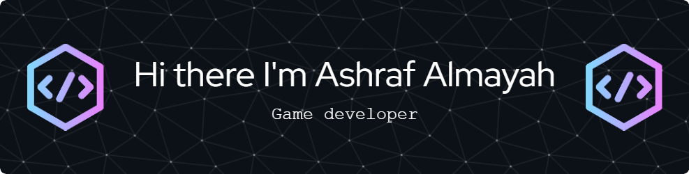

<!--  -->

  

<h1 align="center">Hi there I'm MADASH 👋</h1>
<h4 align="center"> Game developer</h4>

<!-- <h1 align="center"> Hi there! 👋 </h1> -->

<h2 align="center"> I'm Ashraf Almayah, and I'm here to change the game! 🎮 </h2>

<h3 align="center"> About Me 🤓 </h3>
I'm a young software developer with a passion for creating awesome games using Unity. With my trusty programming skills in C# and C++, I'm always pushing the boundaries of what's possible in the world of game development. 

<h3 align="center"> What I Do 💻 </h3>

When I'm not coding up a storm, you can usually find me blasting my way through the latest video games or jamming out to my favorite tunes. I'm also a bit of a tech enthusiast, always keeping up to date with the latest trends and gadgets.

<h3 align="center"> My Goals 🚀 </h3>

My ultimate goal is to become a master game developer, creating games that are fun, engaging, and leave players wanting more. I want to push the limits of what's possible in gaming, while still keeping things fresh and exciting. Who knows? Maybe one day I'll be the one designing the next big hit!

<h3 align="center"> Let's Connect! 🤝 </h3>

If you're as passionate about gaming and technology as I am, I'd love to connect with you! Feel free to drop me a message or check out some of my projects. Let's work together to create something awesome!

<h3 align="center"> GitHub Stats 📈 </h3>

<h3 align="center"> Top Languages 🔝 </h3>

